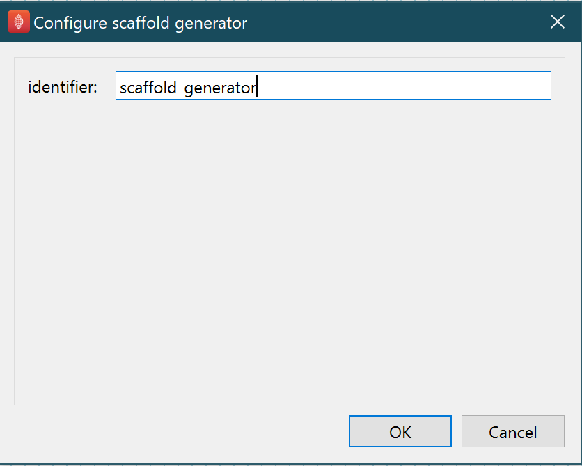

Scaffold Generator
==================

Overview
--------

The **Scaffold Generator** is a MAP Client plugin that generates a scaffold given a list of scaffold setting JSON files.
If a given file in the list of files is not a JSON file or the JSON file is not a scaffold setting file the file will be skipped.

Specification
-------------

Information on this plugin's specifications is available :ref:`here <mcp-scaffold-generator-specification>`.

Configuration
-------------

This step does not have any configuration options other than setting the step identifier.

.. _fig-mcp-scaffold-generator-configure-dialog:

   **Scaffold Generator** step configuration dialog.

Instructions
------------

This is a non-interactive step.
See `Configuration`_.

.. toctree::
  :hidden:
  :caption: Retrieve Portal Data
  :maxdepth: 1

  specification.rst
